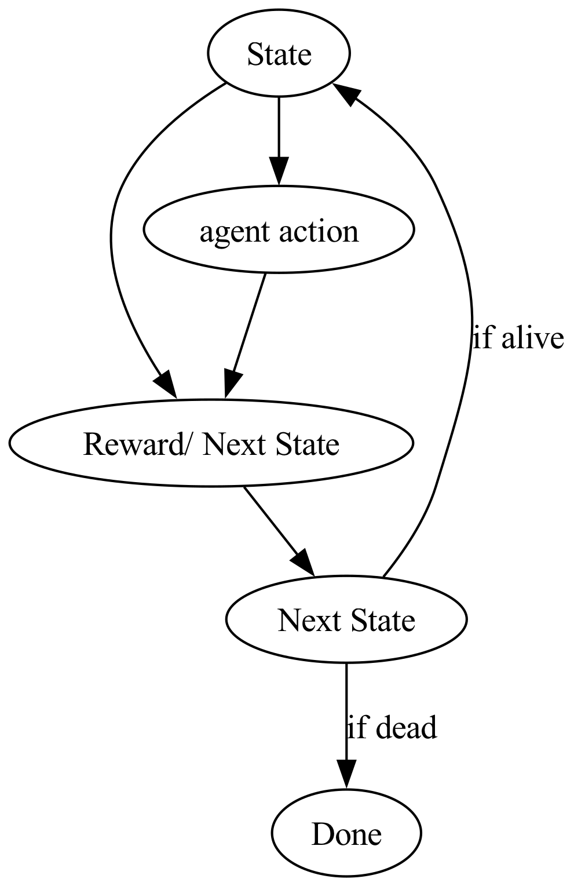

# Flappy Bird Reinforcement Learning
 The idea behind this project is to create a bot that can play flappy bird.[^1] The bot interacts with the world similarly to how a human would play a video game. There are timesteps that happen at very quick intervals. At each interval, the bot gets too choose which move to make given the state of the world. It's actions impact the state of the world. 

In this flappy bird game, the state updates are going to happen approximately every 1/30th of a second (aka the framerate) and the agent is responsible for making decisions at each one of thise timeframes. The state is  measured characteristics like altitude, velocity, distance to next pipe, gap between pipes. The agent is then responsible for answering "Given the state, it is better to jump or not to jump?".

The most obvious way to answer this question is to make a list of states, make a tally of possible actions, and at each timestep, evaluate which action is the best. Now after hours and hours of thinking, the best question is "how do you measure how good each action is in each state?". After every frame, if the agent is still alive we mark it with a reward of 1. If the agent dies, we mark it with a reward of 0.

[^1]: A continuation of a project that I started a few years ago. Let's see if I can find the src. It turns out I had a deleting phase of my life where I deleted all of my repositories because I thought I would never come back to this project. Time to start over. The good news is that I lost the code, but not the knowledge.