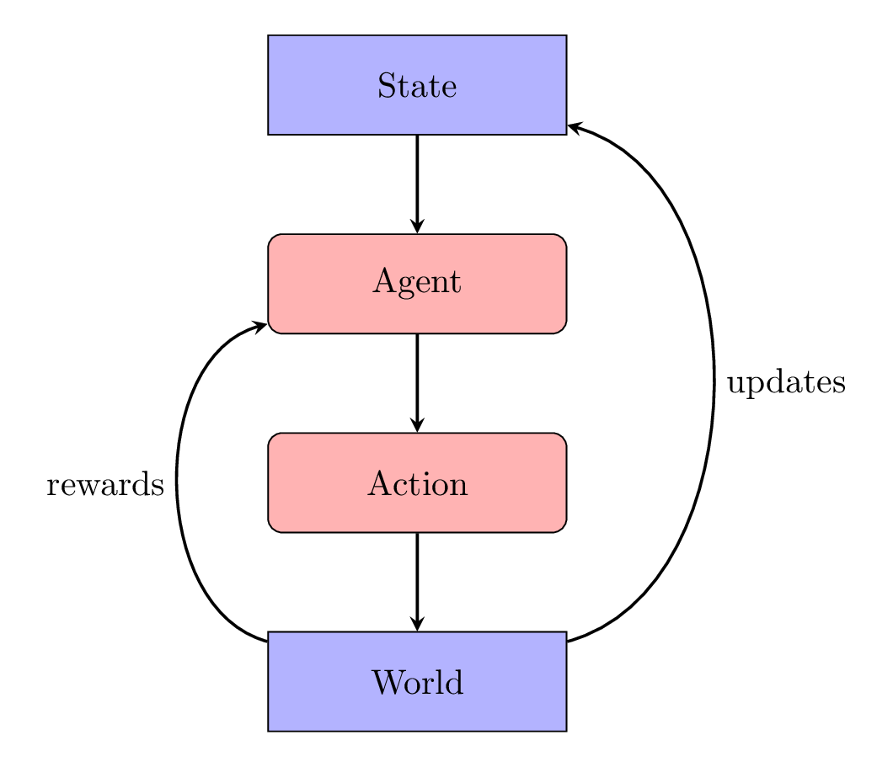

# Flappy Bird Reinforcement Learning

## Introduction
Reinforcement Learning (RL) refers to a general class of algorithms built to explore an environment through trial and error. The algorithm's (agent's) goal is to maximize a reward signal while interacting with its environment sequentially over multiple timesteps. Reinforcement learning formulates the sequential decision making process with a Markov Decision Process (MDP). 

MDPs provide a formal framework to describe agent interaction. This interaction is defined with four components: state, actions, rewards, and transition probabilities. The state space $S$ is the set of all possible situations that an agent can observe. The action space $A$ is the set of all possible actions that an agent can do. The rewards function $R$ is a function $R(S,A) \rightarrow \mathbb{R}$ which maps a state $S$ and an action $A$ to a scalar reward $R$. The transition probability $P(S'|S,A)$ is a function of state $S$ and action $A$ that returns the probability of the next state $S'$.

To demonstrate MDPs in practice, I create an autonomous learning agent which solves the MDP for the Flappy Bird game. Flappy Bird is a good testbench for Reinforcement Learning algorithms because of its finite action space and small state space.

## Background / Related Work

An agent's interaction with the environment can be represented as an MDP trajectory like

$$S_0,A_0,R_1,S_1,A_1,R_2,S_2,A_2,...$$

where:
- $t \in \mathbb{N}$ is the timestep
- $S_t \in \mathbb{R}^d$ is the state at time $t$
- $A_t \in \mathbb{N}$ is the action at time $t$
- $R_t \in \mathbb{R}$ is the reward at time $t$ for state $(S_{t-1},A_{t-1})$

Every MDP must satisfy the Markov Property, the next state is only dependent on the state prior to it, not any other states. This means that it is possible to compute the optimal action at any given time using only a single state. If the Markov property was not satisfied, then the transition probabilities would need to be computed with $P(S' | S_t,A_t,S_{t-1}, A_{t-1},...)$ instead of $P(S' | S_t,A_t)$. This would make learning the optimal policy orders of magnitude more expensive.

The goal of each learning algorithm is to solve the MDP by finding an optimal policy. A policy is a function $\pi$ that maps each state to an action. The optimal policy maximizes the expected reward of all future states. A discount rate $\gamma$ is applied to all future states because future states are less certain than immediate states. The expected reward $G$ at time $t$ is then:

$$G_t \doteq R_t + \sum^\infty_{k=1} \gamma^{k}R_{t+k} = \sum^\infty_{k=0}\gamma^kR_{t+k}$$

The agent can model its expected return by using a state-value function $v_\pi(s)$. The state-value function $v_\pi(s)$ is the expected return of being in state $s$ and following the policy $\pi$ thereafter. 

$$v_\pi(s) \doteq \mathbb{E}_\pi[G_t | S_t = s] = \mathbb{E}_\pi[\sum^\infty_{k=0}\gamma^kR_{t+k} | S_t = s]$$

In the state-action-value function $q_\pi(s,a)$, the expected rewards of each state-action is 

$$q_\pi(s,a) \doteq \mathbb{E}_\pi[G_t|S_t = s,A_t = a] = \mathbb{E}_\pi[\sum^\infty_{k=0}\gamma^kR_{t+k} | S_t = s,A_t = a]$$

In my implementation of the Flappy Bird learning algorithm, I use a state-action-value function to learn the expected reward, which can be solved recursively using the Bellman equation

$$
\begin{align*}
q_\pi(s,a) &= \mathbb{E}_\pi[G_t|S_t = s,A_t = a]\\
&= \mathbb{E}_\pi[R_t + \gamma G_{t+1} | S_t = s, A_t = a]\\
&= \sum_{s'}\sum_{r}p(s',r|s,a)[r + \gamma\mathbb{E}_\pi[G_{t+1}|S_{t+1} = s', A_{t+1} = a']]\\
&= \sum_{s',r}p(s',r|s,a)[r + \gamma q_\pi(s',a')]
\end{align*}
$$

A Bellman equation using $v_\pi(s)$ can be similarly derived.

